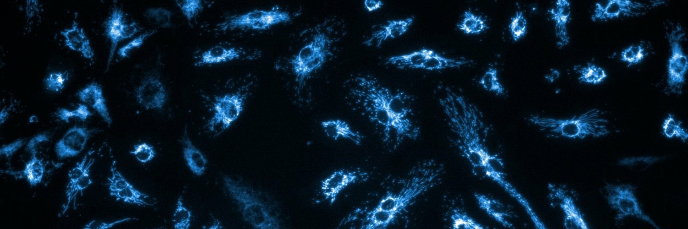

```{=html}
<div class="plate">
  
</div>
```

# Metabolic reprogramming in pulmonary vascular and fibrotic lung disease

::: {.lede}
The Oldham Lab investigates how cellular metabolic reprogramming contributes to
pulmonary hypertension and pulmonary fibrosis. By improving our understanding of
cell metabolism, we aim to develop new therapeutic strategies for the treatment
of lung disease.
:::

We study *in vitro* and *in vivo* model systems with state-of-the-art analytical
techniques, including metabolomics, stable isotope tracing, extracellular flux
analysis, systems biology, and network medicine. The lab is part of the
[Division of Pulmonary, Critical Care and Sleep Medicine](https://dom.med.brown.edu/divisions/pulmonary-critical-care-and-sleep-medicine)
at [The Warren Alpert Medical School of Brown University](https://medical.brown.edu/)
and [Brown University Health](https://www.brownhealth.org/).

## Research

::: {#home-research}
:::

[All research →](research.qmd)

## The lab

::: {#home-people}
:::

[Full roster and alumni →](people.qmd)

## News

::: {#home-news}
:::

[All news →](news.qmd)

## Recent papers

::: {#home-papers}
:::

[All publications →](papers.qmd)
